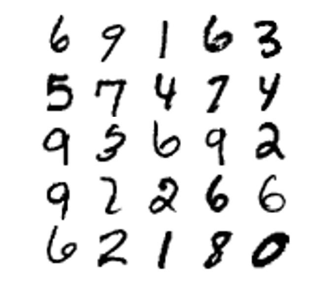
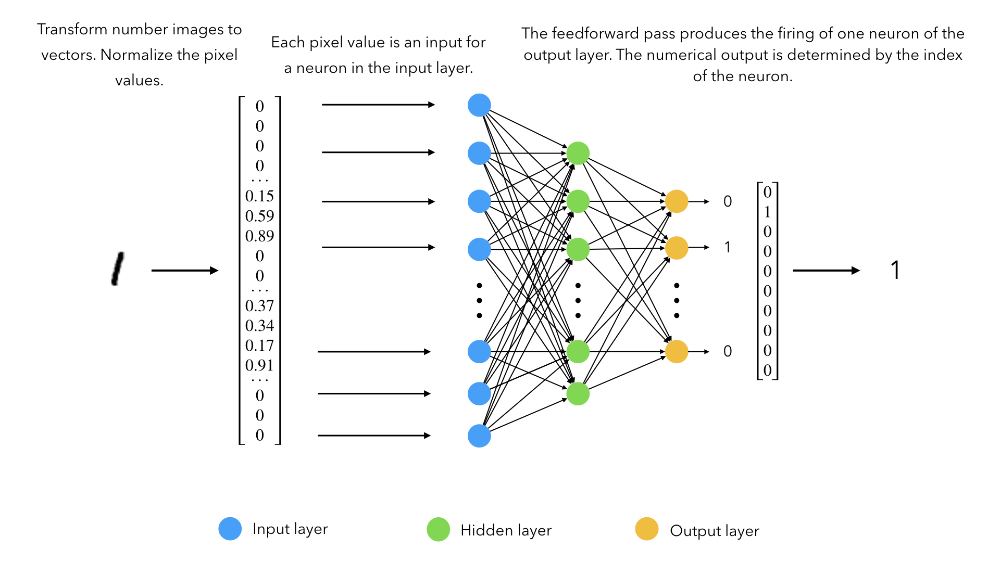
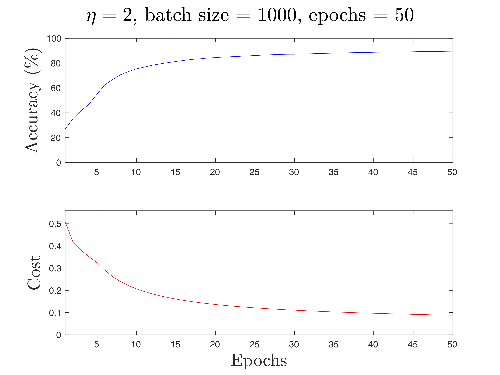

# Neural Network

MATLAB implementation of the building blocks of a neural network. We test the network on the MNIST dataset for classification. Based on the Python 2.7 code from [mnielsen](https://github.com/mnielsen/neural-networks-and-deep-learning).

## MNIST dataset
The original MNIST dataset can be obtained from [here](http://yann.lecun.com/exdb/mnist/).
The dataset used in this implementation has been obtained from [daniel-e repository](https://github.com/daniel-e/mnist_octave).

The MNIST dataset contains images of handwritten numbers from 0 to 9. These images have a size of 28x28 pixels, with 60,000 images on the training set and 10,000 on the test set. In the dataset, each image is transformed into a vector of dimension 1x784. 

  

The images are normalized in the preprocessing, converting each pixel values from 0-255 to 0-1.

## Architecture
The network is formed by the input layer, a hidden layer and the output layer. The preset number of neurons per layer is 784, 30 and 10, respectively. 

The scheme of the computation of the network is represented in the following figure:

  

## Performance
This implementation achieves a maximum accuracy around 95% on test set. The best results are obtained when the learning rate (eta) equals to 3 and the mini batch size is set to 10 (approximately with 15-20 epochs). The code also provides the plot representation of the accuracy and cost over time (parameters were selected for visualization purposes):

  

## Usage

Run `main` from the command window. To modify any parameters, change `main.m`.

## References
1. [Neural Networks and Deep Learning](http://neuralnetworksanddeeplearning.com)
